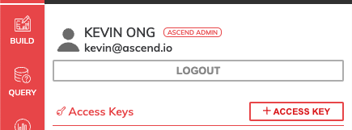
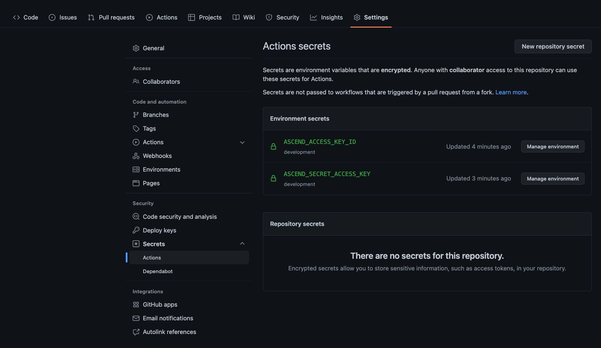
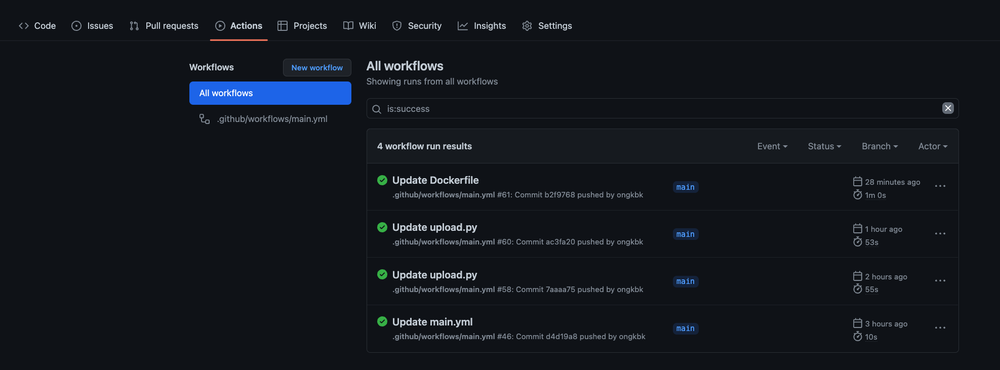

# Ascend CICD for Dataflows

Setup script to generate [Ascend](https://www.ascend.io/) dataflow pipelines. 

## Pre-requisites

* Make sure you have a [github](https://github.com/)/[bitbucket](https://id.atlassian.com/login?application=bitbucket) account.


## Setup guide

```
$ python3 -m venv venv/
$ source venv/bin/activate
$ pip3 install -r requirements.txt
```

Obtain your access and secret keys from your Ascend environment as it is required in the next step.
It can be found from your Profile tab:



### Preparing your credentials
Export your Ascend credentials file as follows based on the credentials you obtained.

```
export ASCEND_ACCESS_KEY_ID=MY_ACCESS_KEY
export ASCEND_SECRET_ACCESS_KEY=MY_SECRET
```

### Initialize the repository for CICD
```
$ python3 init.py
```

Once that is completed, your Ascend dataflow will be downloaded locally. 
You can now create a new remote repo on github/bitbucket and create a webhook for buildkite.
```
$ git remote rm origin
$ git remote add origin YOUR_NEW_REPO
$ git commit -am 'initial commit'
$ git push
```

Go to the `Settings > Secrets` page on github and enter your environment secrets in the same format as local.
You can add them as repository secrets or environment secrets for `development`.



Now, go to `Actions` and build your new CICD pipeline.


